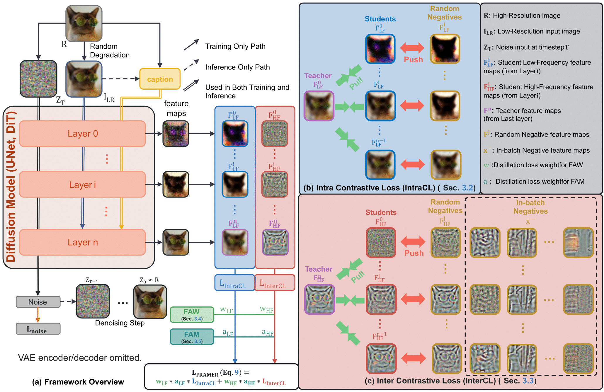
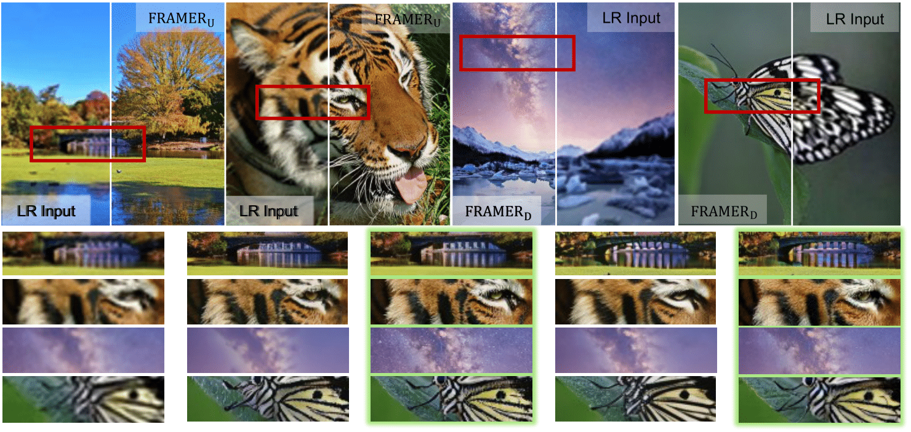

<div align="center">

<h2>🖼️FRAMER: Frequency-Aligned Self-Distillation with Adaptive Modulation Leveraging Diffusion Priors for Real-World Image Super-Resolution</h2>

<div>&nbsp;&nbsp;
    <a href='mailto:choiseungho1019@gmail.com' target='_blank'>Seungho Choi</a><sup>1</sup>&nbsp;
    <a href='mailto:jhseong@cau.ac.kr' target='_blank'>Jeahun Sung</a><sup>1</sup>&nbsp;
    <a href='https://cmlab-korea.github.io/' target='_blank'>Jihyong Oh</a><sup>† 1</sup>
</div>

<div>
    <sup>1</sup>Chung-Ang University, South Korea
</div>
<div>
    <sup>†</sup>Corresponding author
</div>
</div>

<div align="center">
    <h4 align="center">
        <a href="https://cmlab-korea.github.io/FRAMER/" target='_blank'>
        
        </a>
        <a href="https://arxiv.org/abs/2512.01390" target='_blank'>
        
        </a>
        
    </h4>
</div>

---

<div align="center">
    <h4>
        This repository is the official implementation of "FRAMER: Frequency-Aligned Self-Distillation with Adaptive Modulation Leveraging Diffusion Priors for Real-World Image Super-Resolution".
    </h4>
</div>

<div align="center">
    
    <p>
        👆 <b>Qualitative Comparison:</b> Our FRAMER models produce sharper edges and richer details, leading to more visually natural restoration results.
    </p>
</div>

## 📧 News
- **Dec 08, 2025:** This repository is created.
- **Dec 08, 2025:** The paper is available on [arXiv](https://arxiv.org/abs/2512.01390).

## 📖 Abstract
Real-image super-resolution (Real-ISR) seeks to recover HR images from LR inputs with mixed, unknown degradations. While diffusion models surpass GANs in perceptual quality, they often under-reconstruct high-frequency (HF) details due to a **low-frequency (LF) bias** and a depth-wise **"low-first, high-later" hierarchy**.

We introduce **FRAMER**, a plug-and-play training scheme that exploits diffusion priors without changing the backbone or inference. At each denoising step, the final-layer feature map teaches all intermediate layers. Teacher and student feature maps are decomposed into LF/HF bands via FFT masks to align supervision with the model's internal frequency hierarchy.

For LF, an **Intra Contrastive Loss (IntraCL)** stabilizes globally shared structure. For HF, an **Inter Contrastive Loss (InterCL)** sharpens instance-specific details using random-layer and in-batch negatives. Two adaptive modulators, **Frequency-based Adaptive Weight (FAW)** and **Frequency-based Alignment Modulation (FAM)**, reweight per-layer LF/HF signals and gate distillation by current similarity. Across U-Net and DiT backbones, FRAMER consistently improves PSNR/SSIM and perceptual metrics (LPIPS, NIQE, MANIQA, MUSIQ).

## 🖼️ Method Overview

FRAMER is a training-only framework that adds auxiliary loss components. It decomposes features into LF and HF bands and applies frequency-aligned contrastive losses.

<div align="center">
    
</div>

**Key Components:**
1.  **IntraCL (Low-Frequency):** Stabilizes shared structures by comparing students only against the teacher and same-image random layers (no in-batch negatives).
2.  **InterCL (High-Frequency):** Sharpens details using both random-layer negatives and in-batch negatives to encourage instance discrimination.
3.  **FAW (Adaptive Weight):** Reweights distillation based on the relative frequency difference to the final layer.
4.  **FAM (Alignment Modulation):** Gates distillation strength based on student-teacher alignment to prevent early training collapse.

## 🚀 Code Release Plan
**The full code and pretrained models will be released soon.**

- [ ] Training codes for FRAMER (U-Net & DiT)
- [ ] Inference scripts
- [ ] Pretrained models
- [ ] Data preparation guidelines

## 📝 Citation
If you find our work useful for your research, please consider citing:

```bibtex
@article{choi2025framer,
  title={FRAMER: Frequency-Aligned Self-Distillation with Adaptive Modulation Leveraging Diffusion Priors for Real-World Image Super-Resolution},
  author={Choi, Seungho and Sung, Jeahun and Oh, Jihyong},
  journal={arXiv preprint arXiv:2512.01390},
  year={2025}
}
